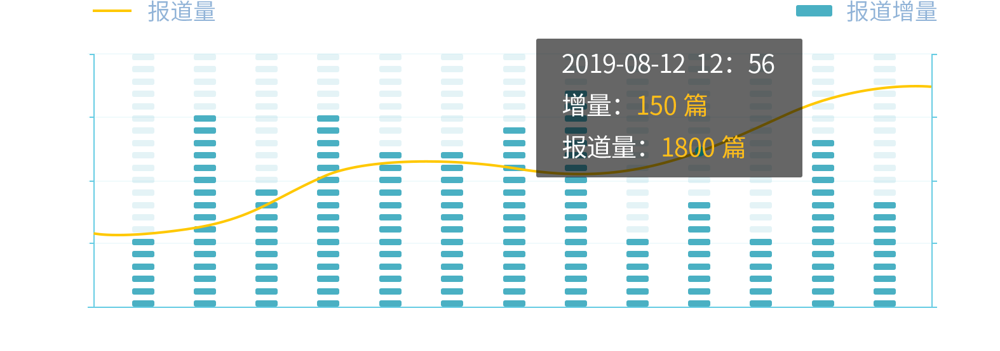
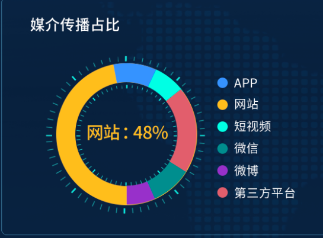

##
echarts社区：https://www.makeapie.com/explore.html#charts=bar~sort=rank~timeframe=all~author=all
echarts配置项api：https://echarts.apache.org/zh/option.html#title
还有几种在示例中不存在的图，例如：词云(wordCloud)、象形图(pictorialBar)

## echarts创建与销毁问题
在当前的dom中，如果init一个pie图，而你在打开一个弹窗时未销毁当前这个图，但弹窗中也要init一个pie图，此时这两个图会冲突，对彼此的数据、显示的效果都会有影响。所以在离开当前dom时，一定要销毁echarts图，避免不必要的麻烦，造成冲突警告
```js
beforeDestroy() {
    this.myChart && this.myChart.dispose();
  },
```

```js
if (this.myChart != null && this.myChart != "" && this.myChart != undefined) {
    this.myChart.dispose();//销毁
}
```

## echarts中引入本地图片的路径写法问题
关系图引入图片的写法是前面加个symbol写法，但是正常的路径字符串由于echarts本身的问题，可能路径会不匹配，所以需要用require准确引入图片。
如果正常写路径是正确的，但是图片始终不能正常显示，则可以使用require引入
`symbol:"image://"+require("../../assets/images/spread-analyse/jjrb-center.png")`
或者
`symbol的images的格式“image://../images/node.png”最好是能够写绝对路径，加上“//..”回到你的根目录。`


## echarts导出生成的图片
```js
exportpic() {
    let myChart = echarts.init(this.$refs.trendChart);
    let picInfo = this.myChart.getDataURL({
    type: "png",
    pixelRatio: 1.5, //放大两倍下载，之后压缩到同等大小展示。解决生成图片在移动端模糊问题
    backgroundColor: "#fff",
    }); //获取到的是一串base64信息

    const elink = document.createElement("a");
    elink.download = "统计图"; //导出文件名
    elink.style.display = "none";
    elink.href = picInfo;
    document.body.appendChild(elink);
    elink.click();
    URL.revokeObjectURL(elink.href); // 释放URL 对象
    document.body.removeChild(elink);
},
```

## echarts 内置工具栏：导出图片，重置等
```js
toolbox: {
        show : true,
        feature : {
            dataView : {show: true, readOnly: true},
            restore : {show: true},
            saveAsImage : {show: true}
        }
    },
```

## echarts分辨率变化后鼠标移入焦点错位
因为全局缩放影响了echarts容器，所以我们要将echarts还原
详细见resize.md中的resize-echarts.js函数模块，是写好的函数，和使用引入方法。

或者在单个文件里添加如下逻辑，两种写法一样。
示例：
```js
/* 加的这个行内样式就是将echarts还原了。 */
<div class="bar_wrap" :style="`zoom:${zoom};transform:scale(${1/zoom});transform-origin:0 0`">
    <div ref="shareBar" class="share_bar"></div>
</div>

mounted() {
    //先初始化一个zoom值，刚进入页面的时候就先缩放了一次。
    this.zoom = 1 / document.documentElement.style.zoom
    //且每次页面大小变化时都要重新计算zoom值，去还原echarts
    window.addEventListener("resize", this.chartReview, false);
},
chartReview() {
    this.zoom = 1 / document.documentElement.style.zoom
    this.myChart && this.myChart.dispose();
    this.createBar();
},
```

## echarts图例问题
### 图例的图形显示bug
series-line. itemStyle:折线拐点标志的样式,如果你想要折线更加平滑，不要拐点，可以设置一个series-line. itemStyle. opacity:0
但是！！！ 他会导致一个问题，如果你的图例legend没有重新设置过itemStyle.opacity,它会继承该系列其他的itemStyle属性，所以也会继承opacity:0.
则导致图例的图形样式，图形透明度变为0，不显示。该图例bug找了快俩小时才找到。

### 当有多个图例，如何分别设置样式
直接在legend中设置多个对象即可，每一个对象对应一个series中的数据，通过name链接上，做映射对应。
```js
legend: [
    {
    selectedMode: false, // 取消图例上的点击事件
    right: "78%",
    itemWidth: 60,
    itemHeight: 5,
    itemStyle: {
        opacity: 1,
    },
    data: [
        {
        name: "报道量",
        icon: "rect",
        },
    ],
    },
    {
    selectedMode: false, // 取消图例上的点击事件
    right: "4%",
    itemWidth: 60,
    itemHeight: 15,
    itemStyle: {
        opacity: 1,
    },
    data: [
        {
        name: "增量",
        icon: "rect",
        },
    ],
    },
],
```

## 象形图
具体需求：类似于柱状图，但是每一列并不是柱状，而是以一个图形或形状来展示当前列的多少。

```js
{
    // 下层块
    name: "total",
    type: "pictorialBar",
    symbol: "roundRect",
    yAxisIndex: 1,
    itemStyle: {
        normal: {
        color: "#1F4683",
        },
    },
    symbolRepeat: true,
    symbolSize: ["50%", "13%"],
    symbolMargin: "45%",
    symbolPosition: "start",
    data: data,
    barCategoryGap: 20,
    animationEasing: "elasticOut",
    },
```

## 自定义图的信息提示框(tooltip)内容
重点就在formatter
其params参数是当前列series中的数据，series中有几个对象，params这个数组中就有几个对象。
我这里做的一个操作目的：该tooltip是象形图的提示，象形图为了形成一个填充的效果(每一列都有一个深色的背景，以浅色的柱来填充这个深色的背景，从而展示长度。)所以series中有一组对象是无意义数据，只是用作背景。所以默认的tooltip会把这个无效数据也给展示出来，自定义是为了把它剔除出来)。返回的str就会直接映射为dom，所以str就是包含html标签的字符串
```js
tooltip: {
    show: true,
    trigger: "axis",
    formatter: function (params) {
    // console.log(params);
    var str = params[0].axisValue + "<br/>";
    for (var i = 0; i <= 2; i++) {
        if (params[i].value && params[i].seriesName!='total') {
        str +=
            "<span style=font-size:40px;color:#FFF;>" +
            params[i].seriesName +
            "</span>: <span style=font-size:40px;color:#FABF48;>" +
            params[i].value +
            " </span><br/>";
        }
    }
    return str;
    },
    padding:[24,44,30,41],
    textStyle: {
    width:300,
    fontSize: 36,
    color: "#F1F1F3",
    },
    backgroundColor: "rgba(0,0,0,0.7)",
    enterable:true
},
```

## pie
关于饼状图的高亮(以下代码全是前辈编写，我拿来即用)
formatter
{a}：系列名。
{b}：数据名。
{c}：数据值。
{d}：百分比。
```js
emphasis: {
    label: {
    show: true,
    fontSize: 40,
    fontFamily: "SourceHanSansCN",
    fontWeight: 500,
    formatter: "{b}:{d}%",
    },
},
```

饼状图要做一个默认高亮所引发的一系列问题：由于设置了默认高亮，
```js
this.myChart.dispatchAction({
    type: "highlight",
    seriesIndex: this.pieSeriesIndex,
    dataIndex: this.pieDataIndex,
});
```
导致了接下来的高亮出了一系列问题，比如高亮时的标签重叠，高亮不正常显示.
所以需要以下代码。
一般是写在默认高亮代码的上方，这里为了解释原因顾放在高亮的下方。
```js
this.myChart.on("mouseover", (params) => {
    this.myChart.dispatchAction({
        type: "downplay",
        seriesIndex: this.pieSeriesIndex,
        dataIndex: this.pieDataIndex,
    });
    this.pieSeriesIndex = params.seriesIndex;
    this.pieDataIndex = params.dataIndex;
    this.myChart.dispatchAction({
        type: "highlight",
        seriesIndex: params.seriesIndex,
        dataIndex: params.dataIndex,
    });
    //设置高亮时标签颜色随着高亮区域颜色变化
    this.myChart.setOption({
        series: {
        label: {
            color: params.color,
        },
        },
    });
});
```

## gauge仪表盘
需求：需要在饼状图的内圈和外圈添加一些刻度。起初我以为是背景图？？，实际是来自echarts的仪表盘。
则写在饼状图的series中即可，和饼状图的数据平级。


```js
{
    // name: "白色外圈刻度",
    type: "gauge",
    radius: "110%",
    center: ["40%", "50%"],
    startAngle: 0, //刻度起始
    endAngle: 359.5, //刻度结束
    z: 4,
    axisTick: {
        show: true,
        length: 20,
        lineStyle: {
        width: 2,
        color: "rgba(1,244,255, 0.9)",
        },
    },
    splitLine: {
        length: 20, //刻度节点线长度
        lineStyle: {
        width: 5,
        color: "rgba(1,244,255, 0.9)",
        }, //刻度节点线
    },
    axisLabel: {
        color: "rgba(255,255,255,0)",
        fontSize: 12,
    }, //刻度节点文字颜色
    pointer: {
        show: false,
    },
    axisLine: {
        lineStyle: {
        opacity: 0,
        },
    },
    detail: {
        show: false,
    },
    data: [
        {
        value: 0,
        name: "",
        },
    ],
    },
    {
    // name: "白色内圈刻度",
    type: "gauge",
    radius: "70%",
    center: ["40%", "50%"],
    startAngle: 0, //刻度起始
    endAngle: 359.5, //刻度结束
    z: 4,
    axisTick: {
        show: true,
        length: 20,
        lineStyle: {
        width: 2,
        color: "rgba(1,244,255, 0.9)",
        },
    },
    splitLine: {
        length: 20, //刻度节点线长度
        lineStyle: {
        width: 5,
        color: "rgba(1,244,255, 0.9)",
        }, //刻度节点线
    },
    axisLabel: {
        color: "rgba(255,255,255,0)",
        fontSize: 12,
    }, //刻度节点文字颜色
    pointer: {
        show: false,
    },
    axisLine: {
        lineStyle: {
        opacity: 0,
        },
    },
    detail: {
        show: false,
    },
    data: [
        {
        value: 0,
        name: "",
        },
    ],
    },
```

## 柱状图
### 问题一
柱状图横坐标内容过长，所以给了一个转动45度，但是有一些不协调，因为转动后内容还是从柱子的中间对齐，就显得稍微横坐标有点靠右。
但是文档中没有直接调整这个的api。
解决：先给了向左的负padding，这样他会跑到左上角去，然后再给margin，设置刻度标签与轴线之间的距离，使其向下移动。
```js
axisLabel: {
    rotate: -40,
    show: true,
    color: "#fff",
    fontSize: 40,
    margin: 78,
    padding: [0, 0, 0, -50],
    fontFamily: "SourceHanSansCN",
},

```

### 问题二
x、y轴的箭头，该箭头可以自定义，引用图片，也可以用svg
```js
axisLine: {
    show: true,
    symbol: [
    "none",
    "path://M5,20 L5,5 L8,8 L5,2 L2,8 L5,5 L5.3,6 L5.3,20",
    ],
    symbolOffset: 10,
    symbolSize: [80, 80],
    lineStyle: {
    color: "#80CAE0",
    },
},
```