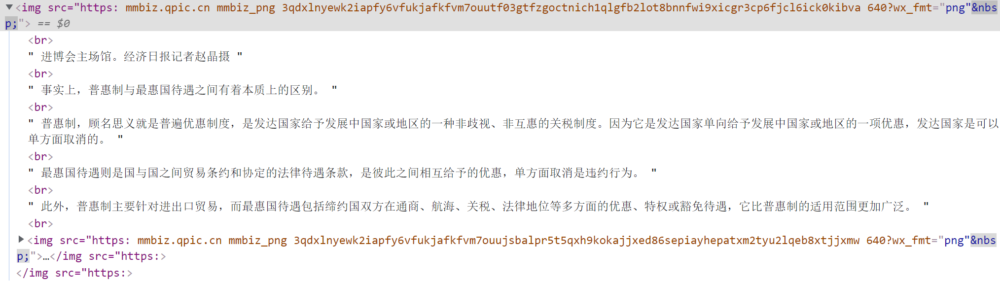

## 创建正则
* 字面量创建`let reg = /a/ig`
* 函数创建`let reg = new RegExp(/a/, ig)`
使用函数创建正则表达式时可以使用变量
```js
let a = '@'
let reg = new RegExp(a,'g') //后面表示匹配模式
```
且在对象的写法中\d、\w、\s、\\.、等前面都需要再加转义符\,也就是说，所有的元字符和在正则中需要转义的内容都需要多加一个转义符。
原因是字符串也会自动转译，字符串会将\d识别为d，所以需要告诉字符串，将他识别为转义符。如果对象型写法正则识别不出来，则可以打印这个正则里的字符串内容，检查它是否和期望的正则一样，有时正是因为少个\（转义符）而导致的匹配不到

## 正则对象的方法(就这俩，还就常用test，主要还是以字符串方法为主)
* test
* exec 返回一个数组（对象），表示exec()参数中，字符串匹配的正则内容，且是详细内容，包含下标，群组等信息，不会全局匹配，基本没法用
```js
let reg = /a/i;
reg.test('abc') // true
ref.exec('bcadf').index // 2 
```

## 字符串方法
* search  `str.search(reg)` 返回下标，不能全局匹配
* match `str.search(reg)` 和exec返回的内容一样，包含各种详细信息。可以全局匹配。但只有不使用全局匹配的时候，也就是不加"g"，才会有详细信息，多个匹配会将匹配内容放在数组中，但只有内容，没有详细信息
* replace `str.replace(reg)` 替换。replace有第二个参数。 ` 'abcdef'.replace(reg, (item,index) => {return item}) `
* split `str.split(reg)` 切割。 `abc(def)ghi.split(/[\(\)]/)` 小括号需要用`\`转译，会得到`[abc, def, ghi]`

## 元字符
* `[ab]` a或b任意一个字符，括号中的"."不需要转译，其他通配符都需要转译加`\`。 `[0-20]` => `[0-2 0]` => `[0-2]`
  * `[a-zA-Z0-9]`
  * 在`[]`中，第一个字符是`^`，表示取反。例如：`'abcdef'.match(/[^d]/g)` 即把非d的给匹配了。`[^\^]` 非上箭头。如果^不是第一个，则代表字符串^含义
* `.` 通配符，匹配任意字符，除了换行符
* `\w` 数字，字母，下划线，包括下划线。
* `\W` 除了数字，字母，下划线，也就是大概的特殊字符。
* `\d` 0-9
* `\D` 除了0-9
* `\s` 空格
* `\S` 除了空格
* `[\S\s] [\d\D] [\w\W]` 所有字符

## 重复
* `/a{6}/` 匹配a重复6次
* `/a{0}/` 代表空字符串，字符与字符之间的，前后也各一个。 `'aaaa'.match(/a{0}/g)` => `['', '', '', '', '']` 
* `/a{2,4}/` 最多4个a，最少2个a。贪婪匹配，优先最大的。
* `/a{0,3}/` 最多3个a，最少0个a，即空字符串。`'aaaaaaa'.match(/a{0,3}/g)` => `['aaa', 'aaa', 'a', '']`
* `/a{0,1}/`=== `/a?/g` 一个或者没有
* `/a{1,}/` === `/a+/g` 至少一个或多个
* `/a{0,}/` === `/a*/g` 可以有，也可以有若干个，也可以是空字符串。`'aaaaaaa'.match(/a{0,}/g)` => `['aaaaaaa', '']`
* `\1 \2 $1 $2` 都是反向引用，引用已匹配的内容。依赖群组，必须与群组配合使用。
  * \1：引用正则表达式中 第 1 个捕获组 匹配到的文本。
  * \2：引用 第 2 个捕获组 匹配到的文本，依此类推（\3, \4, ...）。
  * 捕获组 是通过圆括号 () 定义的，例如 (a)、(\d+)。
  * $1, $2, $3 是替换字符串中的语法，功能类似 \1, \2，但用于替换操作（replace 方法）
  * 全局匹配时：match() 返回所有完整匹配的子串（忽略捕获组）；非全局匹配时：match() 返回一个数组，包含完整匹配 + 捕获组内容。
  ```js
    const str = "abab";
    const regex = /(a)(b)\1\2/; // \1 引用第一个 (a)实际匹配内容为a，\2 引用第二个 (b)实际匹配内容为b。/abab/
    console.log(regex.test(str)); // true，因为匹配 "abab"

    // -----------------------------------------------------------------

    const str = "hello hello world";
    const regex = /(\w+)\s\1/g; // \1 引用第一个 (\w+)实际匹配内容为hello。 /hello hello/
    console.log(str.match(regex)); // ["hello hello"]
    // 若regex改为非全局匹配
    const regex = /(\w+)\s\1/;
    console.log(str.match(regex)); // ["hello hello", "hello"] 会多返回一个捕获组的内容

    // -----------------------------------------------------------------

    // 将 "2023-02-01" 改为 "02/01/2023"
    const date = "2023-02-01";
    const result = date.replace(/(\d{4})-(\d{2})-(\d{2})/, "$2/$3/$1");
    console.log(result); // "02/01/2023"


    // 语法	使用场景	示例
    // \1, \2	正则表达式内部 引用分组	/(a)\1/.test("aa") → true
    // $1, $2	替换字符串 中引用分组	"abc".replace(/(a)(b)/, "$2$1") → "bac"

  ```

## 常见的需要转义的字符串
\  /  .  (  )

## 三种匹配模式
i 忽略大小写
g 全局匹配
s 视为单行匹配，将换行符视为普通的空格匹配
m 将多行内容视为多行匹配（多行内容的每一行单独处理，每一行视为一个匹配单元，每一行单独对待），常有^、$开始结束符，如需要匹配的原内容是多行的，
```js
let hd = `
#1 js,200 #
#2 php,300 #
#3 express,400 # 拓尔思
#4 node,500 #
`
```
贪婪匹配，将这四行通过一个正则匹配出来，可当做四个单独的匹配单元，则用m匹配模式。


## 常用正则
* 1~30个字符，必须包含字母 : ```/^(?=.*[A-Za-z])[A-Za-z\d`~!@#$%^&*()_\-+=<>?:"{}|,./;'\\[\]~！@#￥%……&*（）——\-+={}|《》？：“”【】、；‘'，。、]{1,30}$/```
* 密码，不包含特殊字符  `/^(?=\D+\d)(?=.*[a-z])(?=.*[A-Z])[a-zA-Z0-9]{8,16}$/`
* 密码，包含特殊字符  `/^(?=\D+\d)(?=.*[a-z])(?=.*[A-Z])(?=.*\W).{8,16}$/`

* 字符串去重  `/(\w)\1*/g`

* 密码，不能以数字开头，但必须包含数字、cxy、大写字母、8-16  `/^(?=\D+\d)(?=.*cxy)(?=.*[A-Z])[a-zA-Z0-9]{8,16}$/`

* 文件名由字母、数字、下划线构成，不可以以数字、下划线开头，后缀为.zip/rar/gz  `/^(?=\D)(?!_)\w+\.(zip|rar|gz)$/g`

* 年龄，18-100 `/^(1[8-9]|[2-9]\d|100)$/`

* 15或18位，如果是15位则全部为数字，如果为18位，前17位为数字，第18位为数字或字母x，字母不区分大小写  `/(\d{15}|\d{17}[\dx])/i`

* 三个汉字、中间必须是小或晓  `/[\u4e00-\u9fa5][小晓][\u4e00-\u9fa5]/`

* 给定任何一串数字将其转换为科学计数法(10000 => 10,000)
先看上边这个，从后往前匹配，紧随其后的需是3个或6、9、等3的倍数个数字，但这样如果刚好有3的倍数位，头部也会匹配
let reg7 = /(?=(\d{3})+$)/g
为了避免上述问题，加了个\B 匹配非单词边界（界左界右为同类），由于第一位前面的界左是空，右是字符，左右异类，所以被排除
`/(?=(\B)(\d{3})+$)/g`

* 匹配图片  `/]+src=["']([^'"]+)["'].*?>/g`


## 展开表达式
```js
let str = "houdunren2200fff9988"
    console.log(...str)//字符串每项中间每项都加一个空格
    console.log([...str])//将字符串的每一项都当做数组的每一项
```

## Number.NaN
Number.isNaN() 检查值是否为NaN值

## 正则业务实践
### 一
如果需要在正则验证中添加变量，则需要将正则表达式单独写出来
规则：需要将非正则中使用的符号全部用"\"转义
例如：就是正则验证中添加了videoId变量，去筛选不同videoid的img标签
`let re = new RegExp(']*?videoid=[\'\"]' + self.videoId + '[\'\"][^\>]*>', 'ig')`

解析正则：img和videoid属性之间可能存在任何字符串，除了>右括号，所以[^\>]*?，之后是videoid，和可能出现的两种引号"',引号之间是videoId，在videoid属性之后还可能存在其他属性，但还是不能出现>右括号，所以再加上一组[^\>],最后加上ig全局匹配和忽略大小写。

在确立的正则验证后，在后续的表达式中就可以直接应用。
str.replace(re,function(match,capture1,capture2){
    console.log(match)  //匹配的整体
    console.log(capture1)  //第一个子表达式
    console.log(capture2)  //第二个子表达式
})

### 二

在用v-html渲染后端返回的富文本时，有时由于单引号'或者双引号"的问题，或者某些符号的问题，导致渲染出来的dom结构可能出现问题，比如`<p>fadsfa</p></img>`这个dom结构会使图片无法正常显示，而正文的p标签没啥问题。最终解决方案：
```js
str = str.replace(/]*>/gi,(match,capture) => {
    return ""
})
注：用括号括起来的是群组，用了群组后，match就是匹配到的字符串，后面的每个参数就是对应群组里的内容
```
其实就是把源字符串的img标签替换为空后再手动写入一个一样的img标签，那样就不会有图片显示不出来的问题。

### 三：匹配图片以及其src的正则表达式
`/]+src=['"]([^'"]+)['"]+/g,`
`/]*>/gi`
若想拿到src，则可以向上面踩坑写法一样，用replace配合群组获取。
或者excu方法，但是该方法不能全局匹配
```js
let patt = /]+src=['"]([^'"]+)['"]+/g
let arr = patt.exec(detailDataMsg.item.XQCONTENT)
得到的这个数组第一项是匹配到的字符串，第二项是群组里的内容
```

